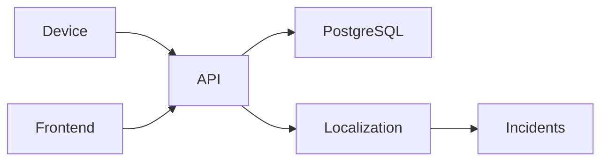

# Architecture

## 1. Data Flow

Telemetry is received through the backend, stored in PostgreSQL, processed by the localization service, and incidents are displayed in the React dashboard.

---

## 2. Telemetry Ingestion

- Devices send telemetry using `POST /api/telemetry`.
- Duplicate messages are ignored using `(device_id, seq)`.
- Old messages are stored but not used for localization.
- Burst messages are debounced for 2 seconds before localization runs.
- Batch telemetry is supported through `/api/telemetry/batch`.

---

## 3. Storage

PostgreSQL with Drizzle ORM.

Main tables:

- `substations`
- `feeders`
- `transformers`
- `poles`
- `telemetry_events`
- `incidents`
- `incident_poles`
- `scheduled_outages`

`parent_pole_id` stores network topology while `is_energized` stores the latest pole status.

---

## 4. Localization Algorithm

### Known topology

- Build a tree from `parent_pole_id`.
- Live → Dark transition identifies the fault span.
- Entire transformer dark → transformer fault.
- Multiple branches allow multiple simultaneous faults.

### Unknown topology

- If topology is unavailable, localize only to the transformer level.
- Require at least two dark poles before creating an incident.
- Confidence is marked as **Medium**.

Complexity is approximately **O(n)** per transformer.

---

## 5. Noise Handling

- Ignore duplicate telemetry.
- Skip scheduled outages.
- Ignore dead devices without power-loss events.
- Debounce bursts before localization.
- Prevent duplicate incident creation.

---

## 6. API

| Method | Endpoint | Purpose |
|---------|----------|---------|
| POST | `/telemetry` | Receive telemetry |
| POST | `/telemetry/batch` | Batch telemetry |
| GET | `/poles` | List poles |
| GET | `/transformers` | List transformers |
| GET | `/feeders` | List feeders |
| GET | `/incidents` | List incidents |
| GET/PATCH | `/incidents/:id` | Incident details/update |
| GET/POST | `/scheduled-outages` | Manage outages |
| POST | `/simulator/*` | Fault simulation |
| GET | `/health` | Health check |

---

## 7. UI

The dashboard contains:

- Network map
- Incident list
- Incident details

Polling refreshes data every **5 seconds**. Confidence and affected poles are shown for every incident.

